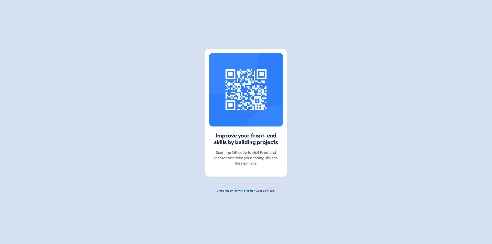

# Frontend Mentor - QR code component solution

This is a solution to the [QR code component challenge on Frontend Mentor](https://www.frontendmentor.io/challenges/qr-code-component-iux_sIO_H). Frontend Mentor challenges help you improve your coding skills by building realistic projects. 

## Table of contents

- [Overview](#overview)
  - [Screenshot](#screenshot)
  - [Links](#links)
- [My process](#my-process)
  - [What I learned](#what-i-learned)
  - [Continued development](#continued-development)
  - [Useful resources](#useful-resources)
- [Author](#author)

## Overview

### Screenshot

### Links

- Solution URL: [Add solution URL here](https://github.com/medievalnudistofthedead/QR-CODE-COMPONENT-MAIN)

## My process

### What I learned

Learned about using margins and padding effectively for different viewports

### Continued development

Continuing in developing skills 

### Useful resources

- [freeCodeCamp](https://www.freecodecamp.org/learn/) - Used the lessons learned from that resource 

## Author

- Frontend Mentor - [@yourusername](https://www.frontendmentor.io/profile/medievalnudistofthedead)
